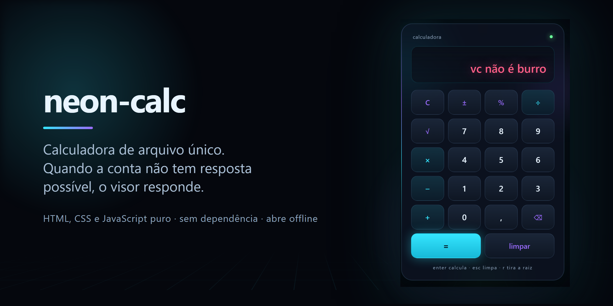

# neon-calc

Uma calculadora em um arquivo só. Abre com duplo clique, funciona sem internet,
sem instalar nada, sem uma linha de dependência.

E quando a conta não tem resposta possível, ela responde outra coisa:

> **vc não é burro**

## Quando isso aparece

Duas contas não têm resultado, e as duas caem na mesma mensagem:

- dividir por zero
- raiz quadrada de número negativo

Não é erro de programa, é resposta. O visor fica vermelho, treme uma vez, e a
próxima tecla já volta ao normal — não trava, não some com o que você digitou
antes, não pede para recarregar.

## Como usar

Baixe o `index.html` e abra. É isso.

Se preferir sem baixar nada: [demonstração ao vivo](https://abner-machado.github.io/neon-calc/).

## Teclado

| tecla | faz |
|---|---|
| `0`–`9` | digita |
| `+` `-` `*` `/` | operação |
| `Enter` ou `=` | calcula |
| `,` ou `.` | vírgula decimal |
| `Backspace` | apaga um dígito |
| `Esc` | limpa tudo |
| `%` | porcentagem |
| `r` | raiz quadrada |

## Decisões que valem explicar

**Ponto flutuante.** `0,1 + 0,2` devolve `0,30000000000000004` em qualquer
linguagem que use IEEE 754, JavaScript incluído. O resultado é arredondado em
doze casas, que corta o ruído sem estragar conta de verdade.

**Limite de quinze dígitos.** Acima disso o próprio número já perde precisão, e
uma calculadora que mostra um valor errado com cara de certo é pior que uma que
recusa a tecla.

**Porcentagem com contexto.** `80 + 25%` dá 100, não 80,25. Com operação
pendente a porcentagem é sobre o primeiro número, como em calculadora física.
Sozinha, `25%` vira `0,25`.

**Movimento.** A aurora do fundo, a grade em fuga e o fio de luz na borda param
inteiros com `prefers-reduced-motion`. Efeito que você não pode desligar não é
design, é imposição.

## Acessibilidade

Texto secundário passa em 6,8:1 sobre o painel, acima do mínimo de 4,5:1 da WCAG
AA — a primeira versão usava um cinza mais escuro, que media 4,29:1 e reprovava.
Toda tecla de símbolo tem rótulo lido por leitor de tela (`÷` é "dividir", `⌫` é
"apagar um dígito"), o visor é uma região que anuncia mudanças, o foco de teclado
é visível, e nenhuma tecla é menor que 44 pixels.

## Licença

MIT.
